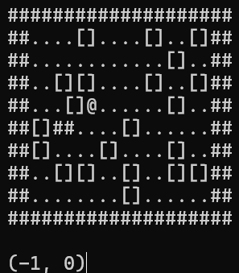

import {SocialLinks} from "../../src/components/SocialLinks";

Hi everyone!

For years, my world has been one of [software architecture and senior-level development](https://www.linkedin.com/in/thorstensuckow/), mainly focusing on integration of frontend systems into large scale web applications. I’ve designed systems, worked with teams of various sizes, and treated software development as a true [craft](https://thorsten.suckow-homberg.de/docs/articles/software-craftsmanship). But sometimes, a single problem can change your entire perspective. For me, that was [Day 15 of Advent of Code in 2024](https://adventofcode.com/2024/day/15).

<!--truncate-->

That little warehouse robot (pictured above) navigating a 2D grid wasn’t just another puzzle. It was the final push, the moment that solidified a long-brewing passion: It made me decide to dive into the world of game development.

As a software developer, I'm captivated by the interplay of design, modular components, optimization, and the final polish that turns code into a seamless experience. Game development feels like a very special expression of this craft: It’s a field where the formal elegance of linear algebra directly creates the visual magic of computer graphics, where every line of code contributes to an interactive world.

It’s the perfect fusion of technical challenge and creative artistry. This is why I'm starting [garagecraft games](/).

garagecraft games is more than just a label: It’s a philosophy. It’s about embracing the hobbyist spirit, the joy of building something from the ground up, and celebrating the art of software craftsmanship in a different medium. A creative space to explore, learn, and share game development.

I hope you’ll follow along, and even more so, I look forward to the day we can all jump into a game session together.

 <SocialLinks />

Let the journey begin,

Thorsten.
