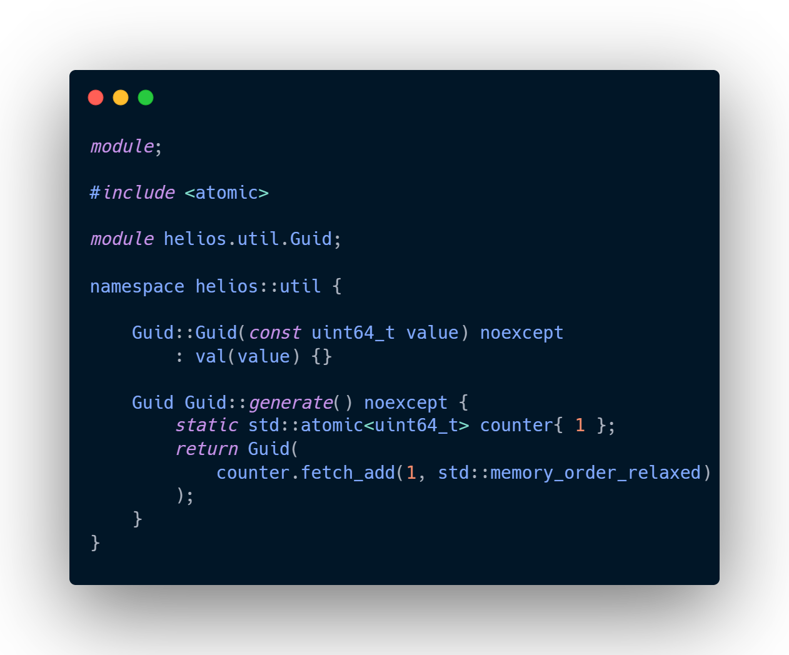

import {SocialLinks} from "../../src/components/SocialLinks";

For a game engine, the first step isn’t rendering a scene or simulating complex physics - it’s laying the foundational bricks. This weekend, I ~eased~ dove headfirst into that foundation for my personal C++ engine project, *Helios*, and it was a fantastic journey through the nuances of modern C++ design.

<!--truncate-->

### Starting with a Clean Slate: C++20 Modules
From the beginning, I decided to build Helios on a modern footing, which meant embracing C++20 modules. Leaving the legacy of `#include` behind, explicit dependency graphs with `import` and `export` are the goal. Solving a few issues solidified a key lesson: with modules, build scripts are as much a part of your architecture as your C++ code (even though the prospect of a legacy audit makes me a little nervous) .

### The `vec3` Story: More Than Just Three Floats
The first real piece of the engine was the humble `vec3`. Sounds simple, right? Yet it became the perfect canvas for exploring modern C++ features. The goal wasn't just to make it work, but to make it efficient, so that hundreds operations in between frames can be run in the shortest time possible.

I wrapped my head around [`constexpr`](https://en.cppreference.com/w/cpp/language/constexpr.html), amongst others, and used it where applicable: constructors, the `operator[]`, and other accessors were all designed to be usable at compile time, which allows for defining constant vectors like world axes or colors that are baked directly into the program, with zero runtime cost[^static_assert].

[^static_assert]: It also enables compile-time validation with [`static_assert`](https://en.cppreference.com/w/cpp/language/static_assert.html), catching bugs before the code even runs.

### The Guid Lesson: Choosing the Right Tool
Next up was a system for unique object identification. My first instinct for the [`Guid` class](https://github.com/garagecraft-games/helios/blob/main/src/helios/util/Guid.cpp) was to hide the implementation details using the **Pimpl idiom** (_Pointer to Implementation_)[^pimpl]. It’s a classic pattern for reducing compile-time dependencies.

[^pimpl]: See https://en.wikipedia.org/wiki/Opaque_pointer (retrieved 17.08.2025)

Well, as much as I like the concept behind the [Bridge Pattern](https://en.wikipedia.org/wiki/Bridge_pattern) and its usage in C++, it was completely the wrong tool for this job: Due to the way the memory is allocated for the referenced data structure (additional heap-allocation for every `Guid` that gets created) and due to the fact that a [pointer indirection](https://www.it.uc3m.es/pbasanta/asng/course_notes/pointers_indirection_with_pointers_en.html) for every single `Guid` would be incurred. For a scene graph with many identifiable nodes, this would impose avoidable performance overhead.

I scrapped the Pimpl (heh!) and rebuilt Guid as a simple, efficient class wrapping a `uint64_t`. It should be as cheap to use as an `int` - benchmarks tba.

### What's Next?
The foundation is now in place. I'm striving for a small math and utility library before I go back to rendering and OpenGL. The process has been a deep dive into not just how C++ features work, but why they are designed the way they are.

The next step is to build on these bricks - to create a scene graph, a Node aggregate, and begin tackling the renderer itself. But I'll do so with the confidence that the code it all rests is solid - and, more important - maintainable.

----------------