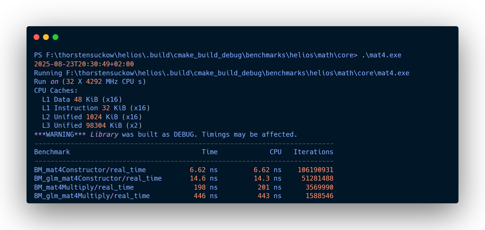
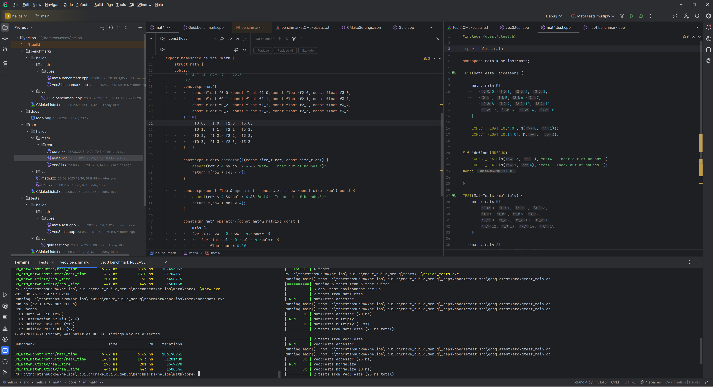

import {SocialLinks} from "../../src/components/SocialLinks";

Today was all about strengthening the core of Helios: First, a deep dive into refactoring `mat4` and `vec3`, and second, a shift in the tools I use to build it.

## Refactoring and Benchmarking: helios.math.core
Until now, types like `vec3` and `mat4` were part of a broader module. Today, I took the time to refactor them into `helios.math.core`.

By isolating these core components, I hope to ensure a more fine grained soc right from the beginning. And speaking of optimization, I dep now on [Google Benchmark](https://github.com/google/benchmark) and put `mat4` to the test.
The power house surely is [GLM](https://github.com/g-truc/glm) (OpenGL Mathematics  library), which I frequently used. However, to get a hang of C++ I decided to implement some of the (basic) requirements myself.

Here's a look at the numbers:

In both constructor and multiplication tests, the helios implementation shows a promising performance - granted, I'm nowhere close to the optimizations of glm which sports much, much more functionality than my basic implementations, but its nonetheless nice to see how the two compare.

### Benchmarking Guid Pointer To Implementation

Remember my bold claim about the[performance drawbacks of pointer-to-implementation and heap allocation](/devlog/helios-engine-foundation)? I’ve put together a benchmark [here](https://github.com/garagecraft-games/helios/blob/main/benchmarks/helios/util/Guid.benchmark.cpp), comparing the regular and PIMPL versions. As expected, the latter comes with a noticeable performance hit:

| Benchmark                        | Time| Time (CPU) | Iterations |
|----------------------------------|------------------|------------|------------|
| BM_GuidGenerate                  | 8.70 ns          | 8.40 ns    | 83,743,377 |
| BM_GuidPimplGenerate             | 92.3 ns          | 92.7 ns    | 7,920,792  |

## A New Workflow: CLion and CMake
I’m parting ways with MSVS (for now) and embracing a more automated, cross-platform workflow with CLion and CMake. The goal is to let modern tooling take care of the heavy lifting, especially with dependency management: It turned out that incorporating Google Benchmark was too much of a hassle (for me at last), but CMake did the trick in no time. I also feel pretty much right at home coming from [composer](https://getcomposer.org), [packagist](https://packagist.org) and [npm](https://www.npmjs.com).

It wasn't without its challenges, and I'm still navigating the learning curve, but the potential benefits in productivity and project maintainability are promising.

## Join Me on the Journey
I streamed this entire process live on [Twitch](https://www.twitch.tv/garagecraft_games). If you want to see the code, the benchmarks, and the occasional head-scratching moment as I stumbled through the new CMake setup, you can [catch the VOD here](https://youtube.com/live/FKKh15M_bzY).

<SocialLinks />
