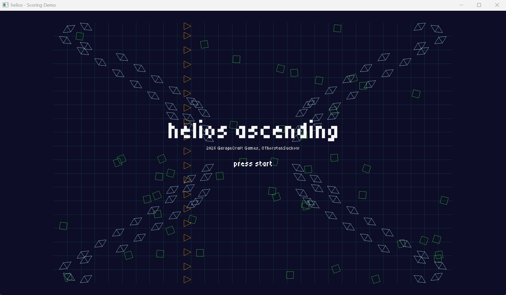
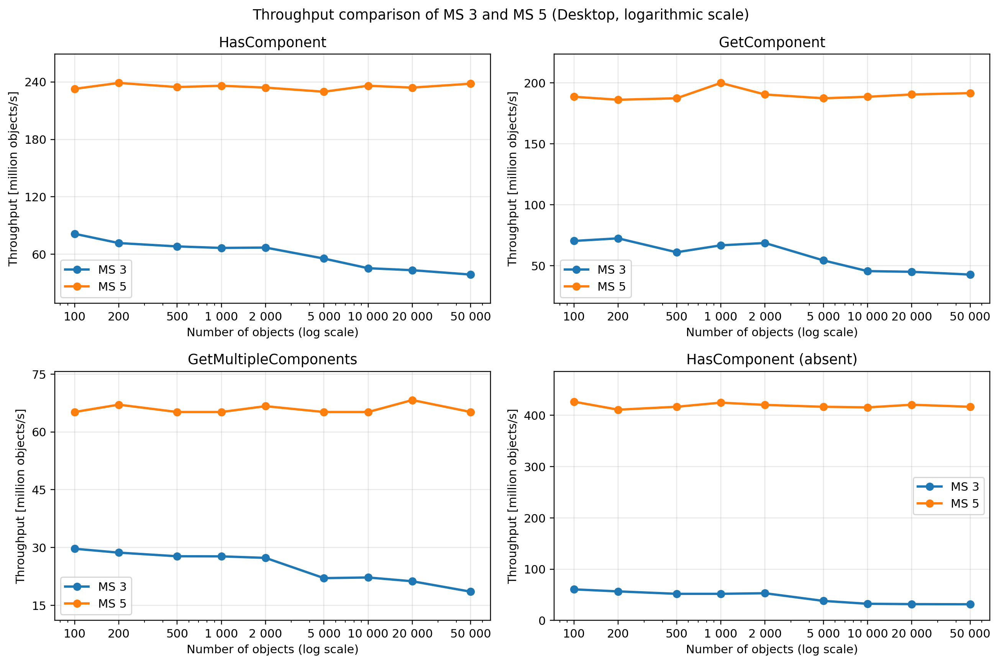
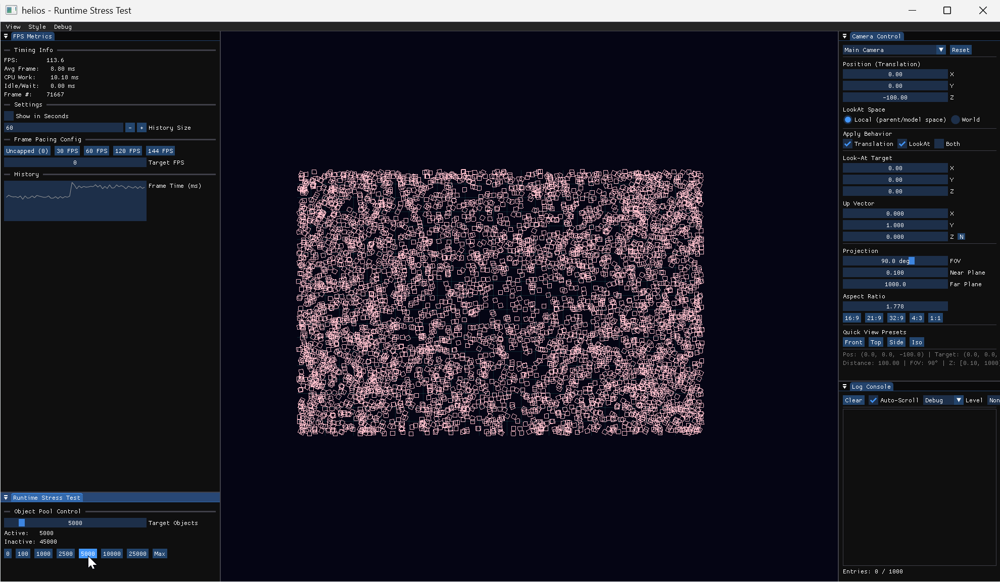

## helios - Exploratory Development of an ECS-based Game Engine

All set and done, project goal reached!

Well, almost...

The project quickly shifted away from its initially intended focus on gameplay and graphics implementation toward a deeper engagement with engine architectures, and the result breaks with classical OOP paradigms: In [the report I published today](https://www.researchgate.net/publication/403758780_helios_Explorative_Entwicklung_einer_ECS-basierten_Game_Engine) (the **engine document**), I document this transition from deep inheritance hierarchies to a data-oriented (DOD) system.

<!--truncate-->

As the demands of integrating runtime systems and gameplay mechanics grew, the classical OOP mental model gave rise to a complexity that could no longer meet the requirements of a clean architecture.
The associated **Array-of-Structures** modeling and the resulting scattered memory layouts also failed to make effective use of CPU-adjacent caches.

The following image shows the throughput of central ECS operations, comparing the OOD approach from Milestone 3 (MS3) with the current DOD ECS implementations from Milestone 5 (MS5). Despite technical debt in early layers and missing draw call optimizations, helios achieves a remarkable efficiency for the agreed project goals.

The focus therefore shifted to implementing an Entity-Component System (ECS) that treats components as information carriers and systems as behavior carriers.
The tension between the developer's familiar hierarchical mental model and the demands of cache-line optimization that emerged from this data-oriented approach is likewise examined in [my report](https://www.researchgate.net/publication/403758780_helios_Explorative_Entwicklung_einer_ECS-basierten_Game_Engine).

Despite unoptimized draw calls, the faster test system[^test] rendered 10,000 animated objects at a stable 60 FPS - far exceeding the original requirements.
The data-oriented system also achieves better scaling under increasing load.

The following image demonstrates the visualization of 5,000 entities at ~110 FPS. The switch to ECS made this level of scaling possible in the first place.

The insights gained from this work I intend to carry forward into a next phase, where I plan to explore a type-safe, domain-specific runtime model for more complex, concurrent game engine architectures - and maybe add some more **juice** along the way - that's definitely missing from the project goals.

[^test]: Desktop: Ryzen 9 9950X3D, 64 GB DDR5 RAM, RTX 5090. Laptop: Intel Core i7-8750H, 16 GB RAM, GTX 1070 Max-Q. All tests were conducted on Windows 11.
